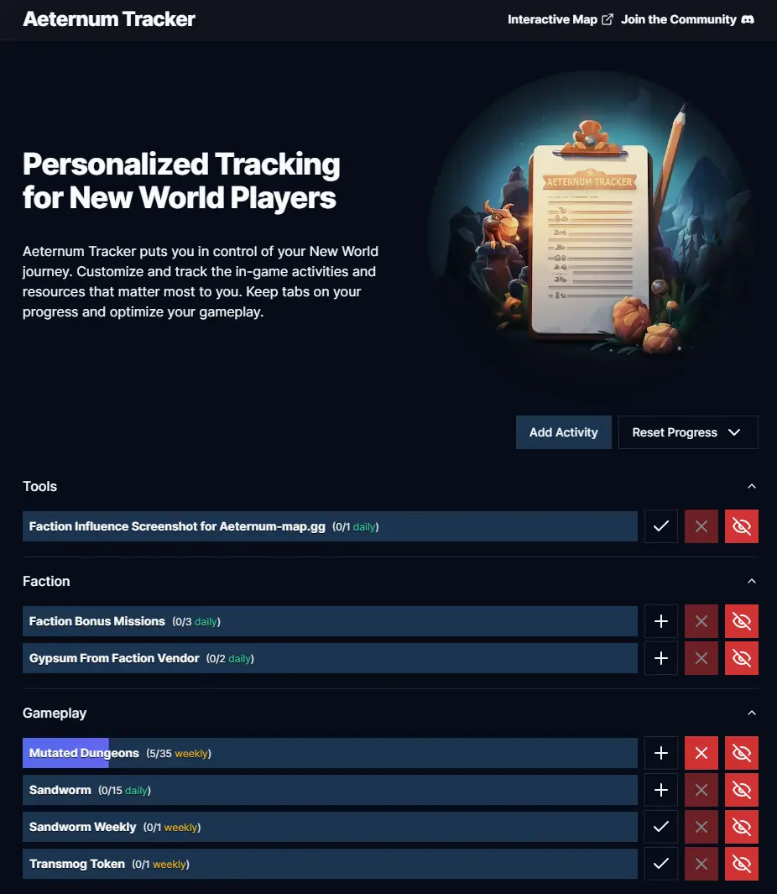

# Aeternum Tracker

Aeternum Tracker is a web application designed to help New World players track and manage their in-game activities and resources. Whether you're a dedicated crafter, a PvE enthusiast, or a PvP warrior, Aeternum Tracker empowers you to customize and track your New World journey.

## Features

- **Custom Tracking**: Tailor your New World experience by selecting the activities and resources you want to track.
- **Progress Monitoring**: The intuitive tracking tool makes it easy to monitor your progress and achievements.
- **Flexible and User-Friendly**: Aeternum Tracker is designed with user convenience in mind, allowing you to optimize your gameplay.

## Contribution

This app is Open Source. Contributors are highly welcome!
Join the [Discord](https://th.gl/discord).

## Licensing

MIT
